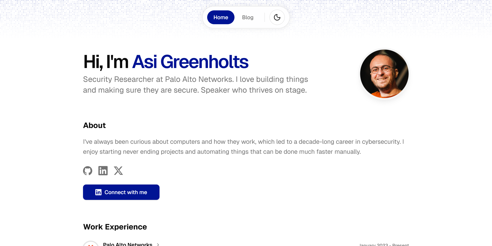

[](https://nextjs.org/)

[](https://react.dev/)


[](https://github.com/tupletype/greenholts.com/actions/workflows/ci.yml)



# Greenholts.com

A responsive personal website built with [MagicUI](https://magicui.design/) templates, featuring my portfolio and blog posts.

## Features

- 🎨 Modern UI/UX
- 📱 Fully responsive with mobile support
- ⚡ Optimized performance ([Core Web Vitals](https://web.dev/articles/vitals))
- 🔍 SEO optimized
- 👨‍💻 Personal portfolio showcase
- 📝 Blog page
- 🔀 Custom 404 page
- ⚙️ Configure by editing [settings files](./src/data)

## Development

### Prerequisites

- Node.js
- pnpm

### Installation

```bash
# Clone repository
git clone https://github.com/yourusername/your-repo-name.git

# Install dependencies
pnpm install

# Start development server
pnpm dev
```

### Update Open Source Projects section

The `update-github-stats` script is used to fetch the Open Source Projects data to `github-stats.json`.

To update your GitHub stats, you can optionally provide a GitHub token as an environment variable:

```bash
export GITHUB_TOKEN=your_token
```

Note: The GitHub token is optional. Without it, you'll be subject to lower API rate limits.

Then run:

```bash
pnpm run update-github-stats
```
